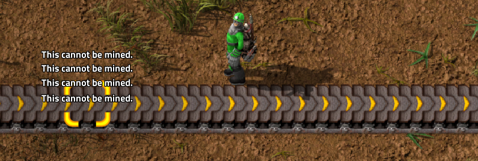
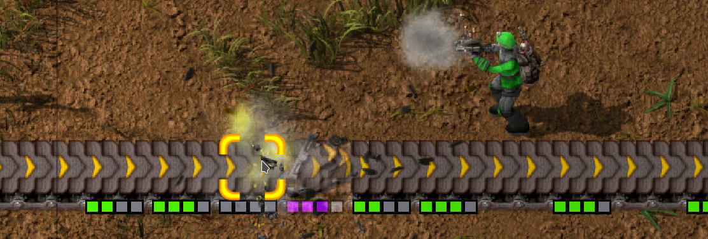

# Permanence Mod for [Factorio](https://www.factorio.com/)

Never remove anything. What could go wrong? This mod makes all placed objects non-removable. The ultimate Factorio hard mode!
Good luck >:D

Available on [GitHub](https://github.com/TomSmeets/factorio-permanence) and in the [factorio mod portal](https://mods.factorio.com/mod/Permanence)

## Use in existing worlds
When added to an existing world, all objects that are newly placed are made non-removable. All objects placed before the mod was present are still removable.

## sudo remove
There is still a way to remove some objects, if you really want to. Just point your machine gun at them and start shooting. Or if you like having fun drop a few nukes on your old factory. Of course this will not return any resources.

## Building
To build the project on Linux just run [build.sh](./build.sh). Otherwise you can read the file and use that as a reference for building on other systems.

## Contact
If you want to play the mod but it is outdated, feel free to contact me at tom@tsmeets.nl or here on [GitHub](https://github.com/TomSmeets/factorio-permanence/issues/new).

## License
This project is licensed under the MIT license. See [LICENSE](LICENSE) for more information.
